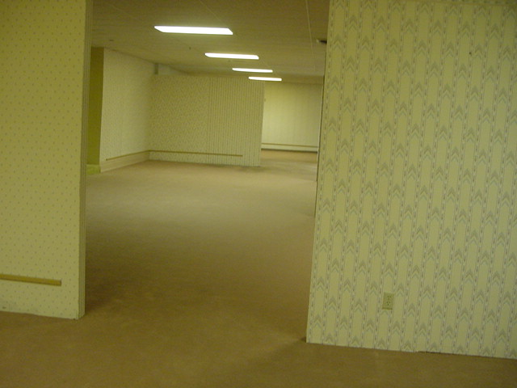
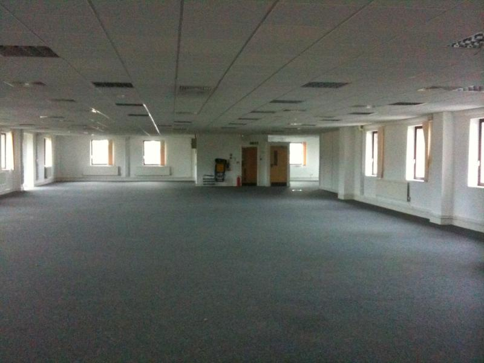
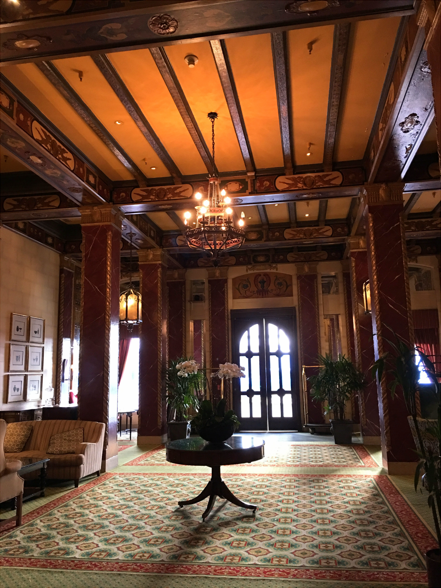
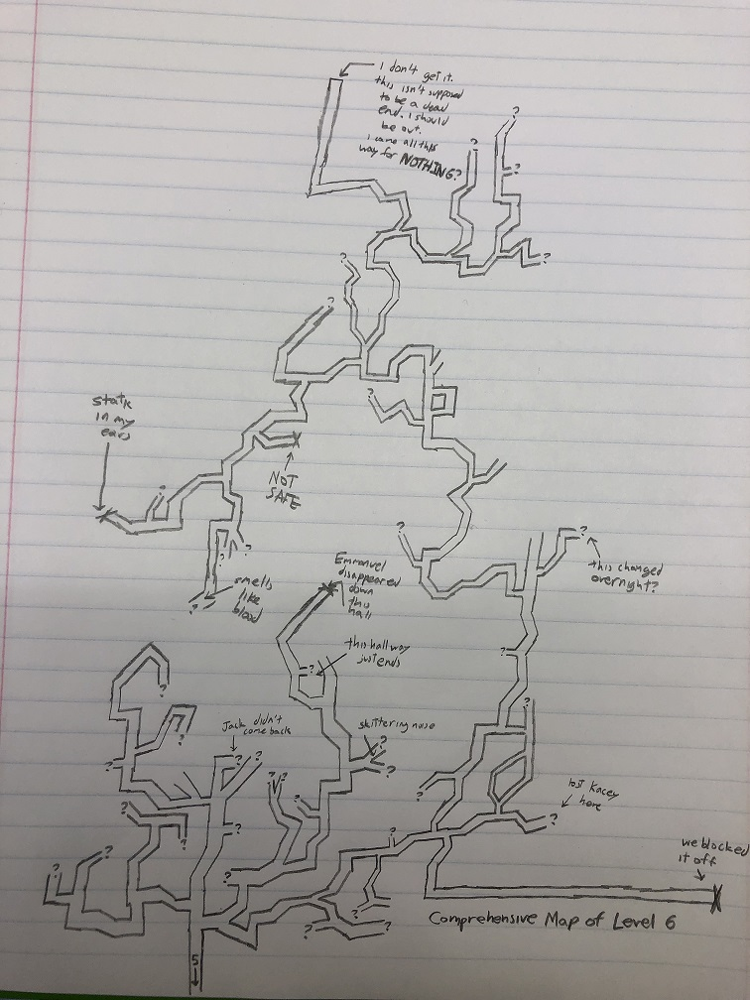
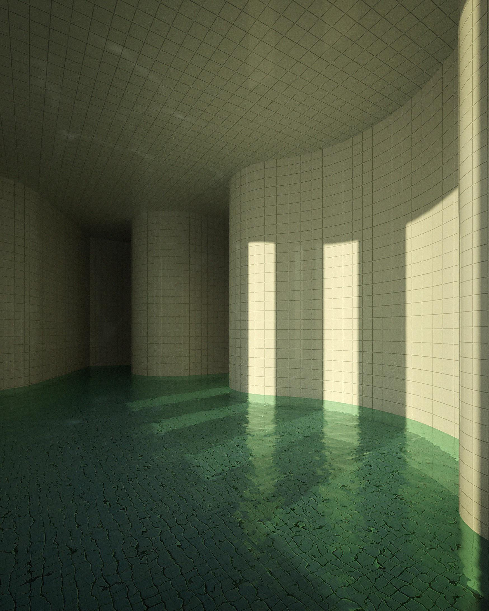

# Game Design Plan

本文档用于确认两层级 Backrooms-like first-person horror demo。使用方式：

1. 查看参考图和候选方案。
2. 在每个 `Decision` 分组中只勾选一个选项。
3. 保存并提交本文档。
4. 让 Codex 根据已勾选选项生成 `Docs/PROJECT.md` 和 `Docs/TODO.md`。

如果某组出现多个勾选项，Codex 会要求重新确认。

## Default Direction

推荐默认方案：

```text
类型：第一人称恐怖探索
结构：两个可游玩的层级
起点：Level 0 风格的初始层级
第二层：优先讨论 Level 2 风格的工业隧道
核心循环：探索 -> 收集线索或钥匙物 -> 避开危险 -> 找到出口 -> 进入第二层 -> 做出结局选择
战斗定位：默认不做战斗系统，以探索、声音、灯光、追逐和资源压力制造恐怖
单局时长：5-8 分钟
目标平台：Unity Editor / Simulator 优先，Quest 后续评估
```

## Reference Boundary

Backrooms Wiki 可作为灵感来源，但项目应优先做原创化表达。

- 不直接复制 Wiki 长文本。
- 不直接使用 Wiki 图片或音频作为项目资产，除非确认授权并保留署名。
- 本文档中的图片已复制到 `Docs/Images/backrooms/`，只作为设计讨论参考，不表示会进入游戏工程。
- 如使用 Wiki 的层级名称、设定或页面内容，应遵守来源页面的许可要求；Wiki 页脚标注为 Creative Commons Attribution-ShareAlike 3.0 License。
- 实际剧情、谜题、房间布局和资产尽量原创。

## Reference Images

### Level 0



- 来源：[Level 0 - “教学关卡”](https://backrooms-wiki-cn.wikidot.com/level-0)
- 设计价值：初始层级辨识度最高，黄色墙纸、潮湿地毯、荧光灯噪音适合做进入后室的第一印象。

### Level 2


- 来源：[Level 2 - “废弃公共带”](https://backrooms-wiki-cn.wikidot.com/level-2)
- 设计价值：工业管道、狭窄走廊、局部黑暗适合做压迫感、追逐、断电和双结局。

### Level 4



- 来源：[Level 4 - “废弃办公室”](https://backrooms-wiki-cn.wikidot.com/level-4)
- 设计价值：空办公区资源需求低，适合文件、终端、密码和错误窗口陷阱。

### Level 5



- 来源：[Level 5 - “恐怖旅馆”](https://backrooms-wiki-cn.wikidot.com/level-5)
- 设计价值：酒店大厅氛围强，适合剧情碎片、复古音乐、仪式感结局。

### Level 6



- 来源：[Level 6 - “熄灯”](https://backrooms-wiki-cn.wikidot.com/level-6)
- 设计价值：几乎全黑，资产成本低，但需要很强的声音引导、心理恐怖和可读性设计。

### Level 37



- 来源：[Level 37 - “崇高”](https://backrooms-wiki-cn.wikidot.com/level-37)
- 设计价值：泳池空间视觉反差大，适合安静、失真、溺水或错误通道结局，但水体成本较高。

## Decision Form

每组只勾选一个选项。推荐项已排在 A。

### Decision 1: Core Theme

<!-- decision:start core_theme -->

- [ ] A. 迷失与逃离（推荐）：目标清楚，适合短 demo。
- [ ] B. 调查与记录：强调文件、录音和环境叙事。
- [ ] C. 追逐与生存：更刺激，但需要实体或危险系统。

<!-- decision:end core_theme -->

### Decision 2: Second Level

<!-- decision:start second_level -->

- [ ] A. Level 2 风格工业隧道（推荐）：压迫感强，实现成本适中。
- [ ] B. Level 4 风格办公室：更容易实现，但恐怖感较弱。
- [ ] C. Level 5 风格酒店：氛围强，但美术成本高。
- [ ] D. Level 6 风格黑暗空间：低资产成本，高音效和引导要求。
- [ ] E. Level 37 风格泳池空间：视觉独特，但水体实现成本高。

<!-- decision:end second_level -->

### Decision 3: Gameplay Focus

<!-- decision:start gameplay_focus -->

- [ ] A. 探索 + 简单解谜（推荐）：最适合零经验项目。
- [ ] B. 探索 + 追逐：更有紧张感，需要实体和逃跑路线。
- [ ] C. 探索 + 资源管理：加入电池、理智值或氧气，但 UI 和数值更多。

<!-- decision:end gameplay_focus -->

### Decision 4: Ending Design

<!-- decision:start ending_design -->

- [ ] A. 第二层两个出口（推荐）：一个好结局，一个坏结局。
- [ ] B. 一个出口 + 一个隐藏条件：普通结局和真结局。
- [ ] C. 倒计时失败结局：超时触发坏结局。

<!-- decision:end ending_design -->

### Decision 5: Entity Design

<!-- decision:start entity_design -->

- [ ] A. 无直接实体（推荐）：用声音、灯光、脚步和远处影子制造压力。
- [ ] B. 一个巡逻实体：实现简单追逐或躲避。
- [ ] C. 一个事件型实体：只在关键节点出现，降低 AI 难度。

<!-- decision:end entity_design -->

### Decision 6: Puzzle Design

<!-- decision:start puzzle_design -->

- [ ] A. 三个钥匙物开门（推荐）：最直观，容易实现。
- [ ] B. 找密码开门：适合办公区或终端玩法。
- [ ] C. 修复电力系统：适合 Level 2 工业层级。
- [ ] D. 跟随声音或灯光：适合 Level 6，但需要好的引导。

<!-- decision:end puzzle_design -->

### Decision 7: Player Tool

<!-- decision:start player_tool -->

- [ ] A. 手电筒（推荐）：恐怖游戏基础工具，能配合电池。
- [ ] B. 摄像机：适合录制、夜视和 UI 风格。
- [ ] C. 指南针或探测器：适合迷宫导航。

<!-- decision:end player_tool -->

### Decision 8: Failure Pressure

<!-- decision:start failure_pressure -->

- [ ] A. 低压探索（推荐）：适合第一版，玩家主要体验氛围。
- [ ] B. 电池消耗：增加资源压力，但要控制难度。
- [ ] C. 实体追逐：刺激，但实现和调试成本更高。
- [ ] D. 理智值下降：氛围强，但反馈设计要清楚。

<!-- decision:end failure_pressure -->

### Decision 9: Level Transition

<!-- decision:start level_transition -->

- [ ] A. 找到异常门进入第二层（推荐）：最容易表达。
- [ ] B. 掉入地面裂缝或 noclip：符合后室气质，但需要过场设计。
- [ ] C. 电梯或维修通道：适合 Level 2 或 Level 4。

<!-- decision:end level_transition -->

### Decision 10: Visual Style

<!-- decision:start visual_style -->

- [ ] A. 低成本写实 + 程序化重复空间（推荐）：适合后室迷宫感。
- [ ] B. 低多边形恐怖：实现快，但风格需要统一。
- [ ] C. 高写实恐怖：效果好，但资源和性能压力高。

<!-- decision:end visual_style -->

## Minimum Demo Scope

第一版必须包含：

- 两个可进入的层级。
- 第一人称移动和视角控制。
- 手电筒或等价照明工具。
- 至少一个简单解谜目标。
- 从 Level 0 到第二层的过渡。
- 第二层两个结局。
- 基础音效、环境氛围和结束界面。

第一版暂不做：

- 战斗系统。
- 多种实体。
- 大型开放地图。
- 背包系统。
- 复杂剧情分支。
- 多人联机。

## Meeting Output

勾选完成后，Codex 将自动整理以下内容到 `Docs/PROJECT.md`：

```text
Game Name:
One Sentence Pitch:
Reference Style:
Target Platform:
Playable Layer 1:
Playable Layer 2:
Core Loop:
Player Tool:
Main Puzzle:
Entity / Threat:
Ending A:
Ending B:
Must Have:
Nice To Have:
Out Of Scope:
```

随后 Codex 会根据 `Docs/PROJECT.md` 拆解第一轮任务到 `Docs/TODO.md`。
