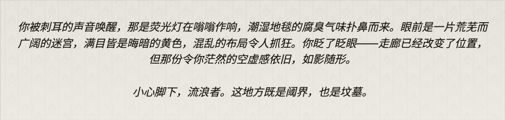
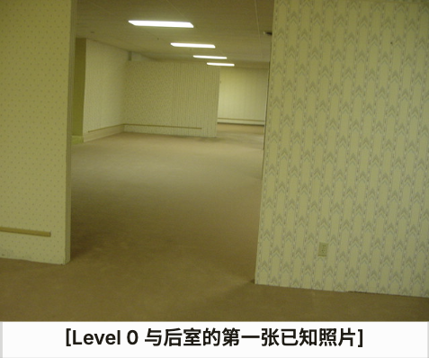
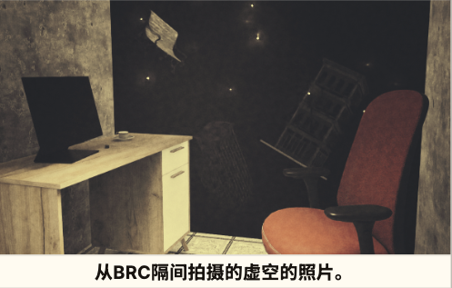

# VR-Game

<p align="center">
  
</p>

本项目是 AI3618 2025-2026 春季学期的 Unity 第一人称后室主题恐怖探索游戏 Demo。当前开发重点围绕场景氛围塑造、实体追逐、层级切换，以及可在 Unity Editor 中直接演示的交互体验展开。项目同时保留了 XR Interaction Toolkit 相关结构，方便后续继续适配 VR 设备。

## 项目简介

- **游戏类型**：第一人称恐怖探索 / 后室风格场景冒险
- **核心体验**：在陌生层级中探索、寻找推进线索、躲避危险实体，并在不同层级之间完成场景过渡
- **当前运行方式**：以 Unity Editor 中的桌面预览为主
- **后续扩展方向**：在现有项目结构基础上继续兼容 XR / VR 设备适配

## 当前游戏内容

### Level 0 - “阈界”

Level 0“阈界”是项目当前最典型的后室层级，整体延续了经典的黄色墙面、荧光顶灯、重复走廊和封闭房间结构。玩家在这一层主要感受到的是封闭空间中的压迫感、方向感缺失，以及被实体追逐时的紧张氛围。

<p align="center">
  
</p>

这一层当前已经实现的内容包括：

- 多房间室内区域的自由探索
- 基础交互物与推进触发逻辑
- 细菌实体的巡逻、追逐与压迫机制
- 从 Level 0 进入下一层的场景转场

### Level 45 - “深渊公司”

Level 45“深渊公司”将体验从室内迷宫压迫感转向高空废墟中的失足风险。场景围绕断裂道路、悬空残骸、破碎建筑和大面积虚空展开，玩家在这一层更需要判断路线、控制移动节奏，并承担高空坠落带来的失败代价。

<p align="center">
  
</p>

这一层当前已经实现的内容包括：

- 从 Level 0 坠入 Level 45 的转场落地流程
- 高空废墟区域中的平台穿越与路径推进
- 玩家坠入虚空后的检测与延迟回退
- 基于检查点的复活机制，用于降低重复试错成本
- 桌面预览与 XR 相关运行支持共存的场景结构

## 项目目录结构

项目正式开发内容主要集中在 `Assets/_Project/` 下。

```text
Assets/
  _Project/
    Art/           项目正式使用的美术资源与主题视觉内容
    Audio/         游戏内使用的背景音乐与音效资源
    Materials/     场景和 Prefab 使用的正式材质
    Prefabs/       可复用的环境模块、道具与玩法对象
    Scenes/        主要可玩场景及其光照、Volume 等附属数据
    Scripts/       项目运行脚本与编辑器工具脚本
    Settings/      渲染管线与项目运行相关设置
  _Imported/       外部导入后、尚未完全整理进正式目录的资源
  Samples/         Unity 或包管理器自带示例内容
  XR/ XRI/         XR Interaction Toolkit 相关资源与支持内容
Packages/          Unity 包清单与锁文件
ProjectSettings/   进入 Git 管理的 Unity 项目设置
Docs/              项目文档与协作说明
```

## 资产与文件管理

当前项目的资源组织方式如下：

### 1. `Assets/_Project/` 用于存放正式使用的项目内容

已经进入实际场景、被脚本引用、或确定会作为正式内容保留的资源，统一整理在 `Assets/_Project/` 下。场景、脚本、材质、音效、Prefab 和设置文件都会按功能分到对应目录，方便后续协作、查找和维护。

### 2. `Assets/_Imported/` 用于存放刚导入的外部资源

从 Unity Package、Asset Store、itch.io、Sketchfab 等来源导入的资源，在尚未完成清理和重组前，会先放在 `Assets/_Imported/` 下。等材质、贴图、Shader、Prefab 结构整理完成后，再移动到 `_Project/` 中对应的正式目录。

### 3. 场景资源按层级分别归档

`Scenes/Level0/` 和 `Scenes/Level45/` 分别保存各层级对应的场景附属资源，例如光照数据、Volume 配置等。这样处理后，不同层级的场景文件、烘焙结果和环境配置不会混在一起，更方便针对某一层单独调整和排查问题。

### 4. Prefab、材质和音频分别独立管理

可复用对象集中保存在 `Prefabs/`，正式材质集中保存在 `Materials/`，音频则继续分为 `Audio/BGM` 和 `Audio/SFX`。目前项目通过这种方式避免同类资源散落在场景目录或导入目录中，也减少了重复拷贝和后期替换时的混乱。

### 5. Unity 资源与 `.meta` 文件一起进入版本管理

项目中进入 Git 的 Unity 资源文件都会连同对应的 `.meta` 一起保留。这样可以稳定保存 Unity 的 GUID、引用关系和场景绑定信息，避免队友拉取项目后出现资源丢失、引用断开或 Prefab 失效的问题。

### 6. Unity 自动生成目录不进入 Git

`Library/`、`Temp/`、`Obj/`、`Logs/` 和 `UserSettings/` 这类目录属于 Unity 在本地生成的缓存或用户环境文件，不作为项目正式资源提交到仓库中。项目当前的版本管理方式也是基于这一原则组织的。

## 打开项目

1. 克隆仓库到本地。
2. 安装 Git LFS：`git lfs install`
3. 如有需要，拉取 LFS 资源：`git lfs pull`
4. 在 Unity Hub 中打开仓库根目录。
5. 等待 Unity 完成资源导入并生成本地缓存目录。
6. 通过 `Assets/_Project/Scenes/Level0.unity` 或 `Assets/_Project/Scenes/Level45/Level45.unity` 打开场景进行预览。

## 相关文档

- [Development Guide](Docs/DEVELOPMENT_GUIDE.md)
- [Unity Project Guide](Docs/UNITY_PROJECT_GUIDE.md)
- [Game Design Plan](Docs/GAME_DESIGN_PLAN.md)
